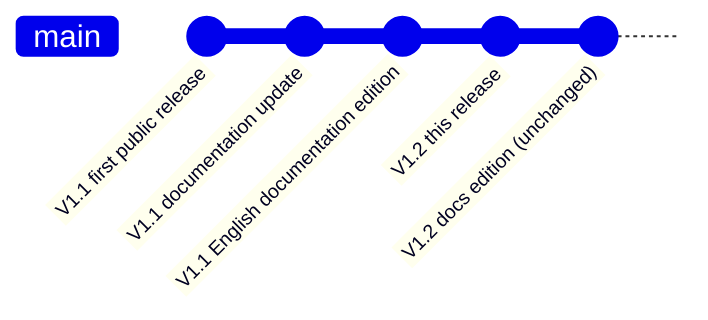

<div align="center">

# Personal Harness

[中文](README.md) · English

**A plugin pack that adds a "personal workstation" shell to DSH Desktop.**

**This is not the repository of "one version" — it is this project's public release line: it only ships releases and can be checked by anyone; it does not express the internal development process.**


[⚠️ Read this first](#-read-this-first-v12-has-the-most-features-but-no-systematic-acceptance-testing-was-done) ·
[⚡ 5-second conclusion](#-5-second-conclusion) ·
[🌳 Version tree](#-version-tree-who-comes-from-whom) ·
[🧭 Version navigation](#-version-navigation-which-one-do-i-want) ·
[🕰️ Timeline](#-timeline-public-releases) ·
[🚀 Install](#quick-start-macos) ·
[📚 Documentation](#documentation)

<sub>Badge images are rendered by shields.io and only affect how this page is displayed; they have nothing to do with how the plugins run — the plugins themselves make no requests to external hosts by default, see <a href="docs/en/PRIVACY.md">PRIVACY.md</a>.</sub>

</div>

---

> **The discipline of this repository**: not one line of official DSH Desktop code is changed · official data is not modified / migrated · no data is uploaded ·
> **known problems and unverified items are always written out plainly** (if it is unverified, it says "unverified" — it is never reported as passing)

---

## ⚠️ Read this first: V1.2 has the most features, but **no systematic acceptance testing was done**

> **This version (Personal Harness V1.2) is the "most features, but no systematic acceptance testing was done" version. It ships with several known problems, and those problems are planned to be fixed in V1.3.**
>
> - **Want stability** → use **V1.1** (release git tag `v1.1.0-macos`); **want the most features and accept the known problems** → use **V1.2** (this release).
> - **Be sure to read [KNOWN_LIMITATIONS.md](docs/en/KNOWN_LIMITATIONS.md) before installing**: every item in it is a **logged fact from real testing** (symptom / scope of impact / current status / workaround), and anything unverified is written as "unverified".
> - This release **provides a macOS install path only**; **Windows is out of scope for V1.2** (see "Platform status" below).
> - This note neither exaggerates nor hides anything: it installs and it uninstalls cleanly, but the problems in that list are real, and this release **did not** do a real-machine visual acceptance pass.

**What it is:** once installed, the left side gains a workbench navigation rail (Home / Conversations / New Task / Task Board / Projects / Workspaces / Recent), the bottom gains a status HUD, and the official session header gains a Quick Stop.

- Not one line of official DSH Desktop code is changed (pure official extension points, compatibility mode)
- Read-only, using only official storage and official APIs; **your conversations, tasks and project data always belong to DSH's official storage** — this release never takes them over, copies them or uploads them
- Install / uninstall / rollback are one command each; a rollback point is created automatically before installing, and a failed install rolls back automatically
- **Privacy**: the four plugins in this release **make no requests to any external host by default**; apart from the exception below, every HTTP request the plugins issue is **same-origin**, targeting DSH's own local routes.
- **The one exception**: the "right-column ChatGPT tab" of `personal-workspace` — **only when you open it yourself** does the host-side half send **one anonymous, read-only GET** to `https://chatgpt.com/` (solely to read the response headers and decide whether it can be embedded; anonymous, no credentials, no cookies recorded, no page body stored).
- No telemetry, no account, no keys, no upload of your data. See [PRIVACY.md](docs/en/PRIVACY.md).

👉 **Using it for the first time? Read [FEATURE_GUIDE.md](docs/en/FEATURE_GUIDE.md) first**: it explains in plain language what each entry point (Home / Conversations / New Task / Task Board / Projects / Workspaces / Recent) is for, when to use it, and what it will not do.

---

## ⚡ 5-second conclusion

| What I want to do | Where to go |
|---|---|
| **Install it on my machine and use it (maximum stability)** | **V1.1** — the only baseline that went through full acceptance and rollback verification · release tag `v1.1.0-macos` |
| **Install it on my machine and use it (most features, accepting the known problems)** | **V1.2 (this release)** — release tag `public-v1.2` · use [🚀 Quick start](#quick-start-macos) |
| **See what known problems this version has** | [KNOWN_LIMITATIONS.md](docs/en/KNOWN_LIMITATIONS.md) (**reading it matters more than reading this page**) |
| **See what each entry point is for** | [FEATURE_GUIDE.md](docs/en/FEATURE_GUIDE.md) |
| **Reproduce the author's complete workbench (third-party plugins must be installed separately)** | [OPTIONAL_PLUGINS.md](docs/en/OPTIONAL_PLUGINS.md) |
| **Know what actually gets installed and whether you can check it yourself** | [Integrity self-check](#integrity-self-check) · [Release artifacts and their corresponding commits](#release-artifacts-and-their-corresponding-commits-verifiable) |
| **See how far platform support goes** | [Platform status](#platform-status-read-this-first) |
| **See what changed in this version** | [CHANGELOG.md](CHANGELOG.md) · on this page [🕰️ Timeline](#-timeline-public-releases) |

---

## 🌳 Version tree (who comes from whom)

```text
Personal Harness (this repository = the public release line)
│
├── V1.1 ·················································· ✅ Stable baseline
│      Three plugins: dsh-personal-sidebar 0.1.24 / dsh-personal-workspace 0.1.20 / dsh-personal-hud 0.1.3
│      Capabilities: sidebar navigation shell / project relationship layer / extra task fields / bottom HUD
│      Release: git tag `v1.1.0-macos` (2026-09-12) + documentation editions `v1.1.0-macos-docs.1` / `.2`
│      This is the version that "the only baseline that went through full acceptance and rollback verification" refers to
│      │
│      └──► V1.2 ·········································· ⚠️ This release (most features)
│              **The genuinely new thing this time = the fourth package Quick Stop** (graceful interrupt + resume in the official session header)
│              The other three packages are version updates: sidebar 0.1.24 → 0.1.28 / workspace 0.1.20 → 0.1.25 /
│                hud 0.1.3 (version unchanged) / quickstop 0.1.1 added this time
│              Four packages = sidebar 0.1.28 + workspace 0.1.25 + hud 0.1.3 + quickstop 0.1.1
│              Release: git tag `public-v1.2` (2026-09-27 · macOS only)
│              **No systematic acceptance testing done**: known-problems list → KNOWN_LIMITATIONS.md (planned to be fixed in V1.3)
│
└── Windows material ·········································· Out of scope for the V1.2 release
       `scripts/windows/*.ps1` and the Windows documentation = experimental material from the previous release V1.1
       (the same commit as V1.1, tagged separately as `v1.1.0-windows-experimental`)
       **No real Windows machine was ever tested**; do not use them to install the V1.2 packages
```

**How to read it (so you do not misread it)**:

- The vertical line = **capability lineage**: V1.2 continues on top of V1.1, it is not a rewrite from scratch;
- **V1.2 is not a replacement for V1.1**: V1.1 is still the only baseline that went through full acceptance and rollback verification, while V1.2 is the "most features but no systematic acceptance testing" version; **the two exist side by side and each can be installed**;
- The Windows material **is not a version line**, it is only experimental material kept from the V1.1 era, and **this release ships no Windows package**;
- Component versions (`0.1.x`) and the product version (`V1.1` / `V1.2`) are two deliberately different schemes: components evolve independently, the product is released by stage. See [docs/ARCHITECTURE.md](docs/ARCHITECTURE.md).

---

## 🧭 Version navigation (which one do I want)

| Version · release tag | Status and installable? | What this version is |
|---|---|---|
| **V1.1** · `v1.1.0-macos` | ✅ **Accepted · frozen** (stable baseline)<br>✅ Installable (most stable) | Three plugins: sidebar navigation shell / project relationship layer / extra task fields / bottom HUD<br><sub>The three V1.1 packages live on the tag `v1.1.0-macos` and are **not in the current working tree** (the `packages/` you see on this page holds only the four V1.2 packages)</sub> |
| **V1.2** · `public-v1.2` | ⚠️ **This release · most features · no systematic acceptance testing done**<br>✅ Installable (install it only if you accept the [known problems](docs/en/KNOWN_LIMITATIONS.md)) | Four plugins: the three above plus **Quick Stop (graceful interrupt + resume)**; macOS only |
| Windows material · `v1.1.0-windows-experimental` | ❌ **Out of scope for the V1.2 release** (and it was never verified on a real Windows machine during the V1.1 era either) | PowerShell scripts and documentation kept from the previous release, for **traceability** only; **do not use them to install V1.2** |

> **Tip**: the install / uninstall / rollback scripts of the two versions differ from each other, so **use the scripts that belong to the version you installed**; do not use the V1.1 scripts to install the V1.2 packages (and vice versa).

---

## 🕰️ Timeline (public releases)

> **Rule**: each entry points at a **real record** (the link text carries the **exact heading** inside that file, so you can search for it and locate it); nothing is written without a record behind it.
> This repository records **public releases** only; the internal development process is not in this repository and is not expressed publicly.



| Date | Version | What changed this time | Where it is recorded (file ｜ heading inside the file) |
|---|---|---|---|
| 2026-09-12 | V1.1 | **First public release**: three plugins (sidebar 0.1.24 / workspace 0.1.20 / hud 0.1.3); brand-new git history, zero private data; project and agent seeds emptied (the first install starts blank) | [CHANGELOG.md](CHANGELOG.md)｜`## v1.1.0 — public-v1.1（首个公开发行）` ｜ tag `v1.1.0-macos` |
| 2026-09-12 | V1.1 | Install documentation and feature-guide improvements (**product features unchanged**) | [CHANGELOG.md](CHANGELOG.md)｜`## v1.1.0-macos-docs.1 — 文档更新（产品功能未变）` |
| 2026-09-12 | V1.1 | Full English documentation path completed (**product features unchanged**) | [CHANGELOG.md](CHANGELOG.md)｜`## v1.1.0-macos-docs.2 — 英文文档版（产品功能未变）` |
| 2026-09-27 | **V1.2** | **Documentation edition (product unchanged)**: the homepage is now written the way this project writes its own version map and timeline (⚡ five-second conclusion / 🌳 version tree / 🧭 version navigation / 🕰️ timeline); documentation no longer points at a release tag that does not exist (it used to say "release tag `v1.1.0`", which is the internal private repository's tag — now the tag that actually exists, `v1.1.0-macos`); audit row A9 added (a check inside the release packages, plus the tooling gap); **product source and install scripts are byte-for-byte unchanged** | [CHANGELOG.md](CHANGELOG.md)｜`## v1.2.0-docs.1 — public-v1.2-docs.1（文档版：**产品功能未变**）` ｜ tag `public-v1.2-docs.1` |
| 2026-09-27 | **V1.2** | **This release (macOS only)**: adds the fourth package **Quick Stop** (graceful interrupt + resume in the official session header); the three existing packages get version updates; a new [known problems and limitations](docs/en/KNOWN_LIMITATIONS.md) list; the privacy statement is **narrowed to be exact** according to what the source actually does (the only external domain = the one anonymous read-only GET when you open the right-column ChatGPT tab yourself); the uninstall / rollback script plugin list now **derives from `manifest.json`** (fixing "the fourth package installs but cannot be uninstalled") | [CHANGELOG.md](CHANGELOG.md)｜`## v1.2.0 — public-v1.2（macOS）` ｜ tag `public-v1.2` |

**Why is there a fortnight between V1.2 and V1.1**: the changes of those two weeks did **not** become public versions — V1.2 is a **one-off** release cut from the internal development results, and this repository does not publish the development process release by release.

---

## The three layers (read this first; get this straight before installing)

```text
Harness Web UI
    ↓ hosted and loaded by DSH Desktop
DSH Desktop
    ↓ with the four Personal Harness plugins installed
Personal Harness
```

1. You must **install DSH Desktop first and be able to start it normally** — this is a precondition, not an optional step;
2. **DSH Desktop hosts the Harness Web UI** and provides the local plugin loading environment;
3. **Personal Harness is not a standalone app, not a browser extension, and does not replace Harness or DSH Desktop**; it is only a UI / organisation layer installed into DSH Desktop;
4. After downloading or cloning this repository, run the **macOS** install script `scripts/install.sh` (this release (V1.2) has a macOS install path only; the Windows scripts kept in the repository are **out of scope for the V1.2 release**, see "Platform status" below);
5. The install script **automatically discovers all four `.tgz` files under `packages/`** and installs them into the **local profile of DSH Desktop** (by default `~/.dsh/profiles/desktop`), with **no arguments to change**;
6. After installing you must **fully quit and restart DSH Desktop** (⌘Q / a real quit, not minimise) before the plugin interface appears — plugins are only loaded when the host starts;
7. **Running the Harness Web UI on its own in a browser is not a verified install path**, and there is no promise that pointing it at this repository will work directly (what this release verifies is the path "DSH Desktop loads local plugins").

## Platform status (read this first)

| Platform | Status |
|---|---|
| **macOS + DSH Desktop 2.0.5** | **Verified** (install / reinstall / uninstall / rollback all tested end to end) |
| Other macOS / DSH versions | **UNTESTED** (the install script first refuses to install silently and requires explicit confirmation) |
| **Windows** | **Out of scope for this release** (the Windows material kept in the repository is experimental material from the previous release V1.1 and was not verified with V1.2) |

> ## ⚠️ Windows: out of scope for this (V1.2) release
>
> **This release (V1.2) ships macOS only.** The `scripts/windows/*.ps1` files and the Windows documentation kept in the repository belong to the **experimental material of the previous release V1.1** and **have never been verified with the V1.2 packages**.
>
> - **Do not use them to install the V1.2 packages.**
> - That material was **never verified on a real Windows DSH Desktop** during the V1.1 era either — installation, interface, uninstall and rollback, **not one of them was verified**; only PowerShell 7 syntax parsing and logic dry-runs in a non-Windows environment were done, and **no real Windows machine was ever tested**.
> - The plugin core uses web platform interfaces, so it might be compatible in theory; but the Windows version of DSH Desktop, its profile paths, extension interfaces and pnpm behaviour may all differ.
> - You may need to modify paths, scripts or configuration to match your actual DeepSeek Harness / DSH Desktop installation before it could work.
> - **There is no guarantee that a clone can be installed directly, and no guarantee of compatibility with any Windows version.**
> - If you still want to try it on Windows: **back up your own DSH profile first**; if a problem occurs, **stop immediately and restore the backup**. You carry the risk yourself.

The verification boundary of the Windows material is in [docs/WINDOWS_EXPERIMENTAL_STATUS.md](docs/WINDOWS_EXPERIMENTAL_STATUS.md) (a record from the previous release V1.1 era): **the script syntax and logic were exercised under pwsh 7, but no real Windows machine was tested, and they were not verified with the V1.2 packages.**

> This is the public release of a **personal tool for the author's own use**, not a commercial product. Please read [KNOWN_LIMITATIONS.md](docs/en/KNOWN_LIMITATIONS.md) first: it works and it uninstalls cleanly, but **several known problems were not fixed this time** (no systematic acceptance testing was done for this release, see the warning at the top of this page).

---

## What it actually adds (this is all of it)

| Capability | Description |
|---|---|
| **Sidebar navigation shell** | Renders "Home / Conversations / New Task / Task Board / Projects / Workspaces / Recent" into the official sidebar slots; it folds back automatically in a narrow sidebar and does not fight the official layout |
| **Project layer** | A relationship layer that groups conversations/tasks under "projects", persisted on this machine (key `dsh.personal.projects.v1`). The public release starts **empty**; you create the projects yourself |
| **Extra task fields** | The official task ledger only accepts `title/description/prompt/workspaceId/mode/permission/model/schedule` (a strict key whitelist; one extra key rejects the whole request with a 400). So "due date / expected deliverable / constraints / notes" are stored **on this machine** by this layer and echoed back in the interface |
| **Agent directory** | The directory interface works, but the public release **contains no preset agent** (it starts empty); you fill in the directory yourself |
| **Bottom HUD** | A one-line status bar (current view / conversations / task counts) |
| **Quick Stop** | Provides "graceful interrupt + resume" in the official session header (the fourth package added by this release, `dsh-personal-quickstop`). One known problem related to resume is documented in [KNOWN_LIMITATIONS.md](docs/en/KNOWN_LIMITATIONS.md) |

**What it is not:** not a replacement for or a fork of DSH Desktop; it contains no official source code; it contains no AI model, API key, account or credential; it never modifies, deletes or migrates any of your DSH data.

---

## Want to reproduce the author's complete workbench? (optional third-party plugins)

**This repository distributes only the four plugins above.** The author's own DSH Desktop also has a number of **third-party** plugins installed, and a fair share of how it looks and how it works comes from them — but they are **not in this release package**, and this repository does not bundle or redistribute them. The complete list, the source check (public source / licence / whether an account or token is needed) and the testing status are in **[OPTIONAL_PLUGINS.md](docs/en/OPTIONAL_PLUGINS.md)**.

The three groups in one line each:

| Group | Which ones | Notes |
|---|---|---|
| **Close to the author's interface (install separately)** | `dsh-better-sidebar`, `@linxin666/dsh-client-ui-task-board`, `dsh-cost-meter`, `dsh-restart-button`, `@linxin666/dsh-client-ui-git-graph`, `@duke-dsh-plugins/dsh-agent-approval` | Third-party work, each installed and licensed separately. `better-sidebar` and `task-board` are important prerequisite capabilities for the complete-workbench experience |
| **Optional: closer to the author's workflow (install if you need them)** | `@deepseek-ai/dsh-compaction-basic` (the author actually runs the community implementation `dsh-compaction-instant`), `@liustack/modlens`, `@vectorize-io/hindsight-coding-agents`, `dsh-notion-mcp`, `dsh-pocket` | They solve context compaction / image understanding / long-term memory / Notion connection / phone-based remote access respectively; skipping them does not affect the core experience |
| **Not distributed by this repository** | All of the third-party plugins above; among them `@vectorize-io/hindsight-coding-agents` (the public package has **no licence field**) and `dsh-pocket` (**GPL-2.0**) are **also unsuitable** for us to package and redistribute on licensing grounds | To install them, use their own public sources |

**Do not expect "after installing it will necessarily be exactly the same as the author's".** Your own DSH Desktop version, account state, theme, window layout, model, balance, plan, permissions and the version of each third-party plugin all cause differences; this repository is responsible only for the interface and behaviour of its own four plugins.

> We **checked and honestly recorded** the sources and licences of those third-party plugins, but we did **not** run any install / uninstall verification for them in a clean profile — every entry in `OPTIONAL_PLUGINS.md` states its testing status, and untested is written as untested.

---

## Quick start (macOS)

Prerequisites: macOS + **DSH Desktop 2.0.5** installed (other 2.x versions: see [COMPATIBILITY.md](docs/en/COMPATIBILITY.md)) + Node.js ≥ 20 + `pnpm`.

### Recommended way: let an AI install it for you (it reads the documentation, you confirm)

> Send the link to this repository to an AI **you trust and that can access your computer's terminal**, and have it read the install documentation, then help you download, check the prerequisites, create a backup and install.
> Installing manually is possible too, but you have to run every command yourself and it is easy to miss a step.

You can send it the text below together with the repository address:

```text
This is an open-source repository I'm giving you: <repository address>
Please read README_EN.md and docs/en/INSTALL_MACOS.md in full first, then:
1) Check whether my machine meets the prerequisites: the DSH Desktop version, Node.js ≥ 20, and whether pnpm is available;
2) Tell me which profile directory this install will modify and where the backup will be stored;
3) Run the install only after I confirm;
4) After installing, remind me to fully quit and restart DSH Desktop (plugins are only loaded when the host starts);
5) Show me the output of every step.
If something is not satisfied or you are unsure, say so directly — do not guess on my behalf and do not skip checks.
```

Why this is recommended: the install itself is only a few commands, but **missing one step makes people believe "the plugin doesn't work"** (most commonly because the host was not restarted after installing). An AI can check them one by one with you.

Please also make sure both you and the AI are clear about these boundaries:

- The AI **must be able to access your local terminal** to be able to download and install for you; if it cannot, it can only give you a command list to run yourself;
- The AI should check DSH Desktop, Node.js and pnpm **before** installing, and state **which profile will be modified** and **where the backup goes**, then **wait for your confirmation**;
- After installing it should remind you to **fully quit and restart DSH Desktop**;
- Backups, installation and system permission prompts are still for **you to confirm**;
- **Running the Harness Web UI on its own in a browser is not a verified install path for this release** — what this release verifies is the path "DSH Desktop loads local plugins".

### Manual install

```bash
git clone <the address of this repository> dsh-personal-harness
cd dsh-personal-harness
bash scripts/install.sh --dry-run   # see what it plans to do first (a real dry-run: no directories created, nothing copied, nothing installed)
bash scripts/install.sh             # install into $HOME/.dsh/profiles/desktop
```

Then **fully quit DSH Desktop and open it again** (plugins are loaded when the host starts).

```bash
bash scripts/uninstall.sh        # uninstall (keeps all of your data by default)
bash scripts/rollback.sh         # return to the state before this install
bash scripts/rollback.sh --list  # list the available rollback points
```

Details: [INSTALL_MACOS.md](docs/en/INSTALL_MACOS.md)｜[UNINSTALL.md](docs/en/UNINSTALL.md)｜[ROLLBACK.md](docs/en/ROLLBACK.md)

Windows: **out of scope for this (V1.2) release**. The `scripts/windows/*.ps1` kept in the repository are **experimental material from the previous release V1.1** and **were not verified with the V1.2 packages** — **do not use them to install the V1.2 packages**.

```powershell
# The commands below belong to the experimental material of the previous release V1.1; they are out of scope for the V1.2 release and were not verified with the V1.2 packages
powershell -ExecutionPolicy Bypass -File .\scripts\windows\install.ps1 -DryRun
powershell -ExecutionPolicy Bypass -File .\scripts\windows\install.ps1 -AllowUntested
```

Details: [INSTALL_WINDOWS_EXPERIMENTAL.md](INSTALL_WINDOWS_EXPERIMENTAL.md) (material from the previous release V1.1 era; its "unverified" status statements are kept as they are).

---

## Integrity self-check

The release contains `manifest.json` (the sha256 of each package, the embedded commit, the host compatibility range) and `checksums.sha256`. The install script verifies them before installing, and after installing it **compares byte for byte** the `client.js` inside the profile against the release package.

```bash
npm run verify     # full self-check: package hashes / install consistency / no private data
npm run test       # artifact contract tests (71 checks / 0 failures; the same in both development and production mode)
npm run compat     # print the host compatibility verdict for this machine
```

If you want to build from source yourself instead of using the pre-packaged `.tgz` files:

```bash
npm install        # installs build-time dependencies only (esbuild / jsdom); they are not part of the release artifacts
npm run verify     # verify the four .tgz files shipped with the repository (hashes / embedded commit / install consistency / no private data)
npm test           # artifact contract tests (71 checks / 0 failures; the same in both development and production mode)
npm run compat     # print the host compatibility verdict for this machine
```

Notes (to avoid misunderstanding):

- A fresh clone does not yet have `src/workstation/*/build/` (the build output directory, which by convention is not committed to git), so `npm run verify` / `npm test`
  **restore those bundles automatically from the `.tgz` files shipped with the repository under `packages/`**, and then check them byte for byte against the sha256 values in `manifest.json`.
  In other words: **you can verify whether the package you received has been modified without compiling anything.**
- To verify that "the source code can be recompiled into the same package":
  `npm run build && npm run package && npm run verify` (after rebuilding, `client.js` should be byte-identical to the released one).

---

## Version and composition

| Item | Value |
|---|---|
| Product version | **Personal Harness V1.2** (release git tag `public-v1.2`) |
| Previous version (stable baseline) | **Personal Harness V1.1** (release git tag `v1.1.0-macos`) |
| Components | `dsh-personal-sidebar` 0.1.28 ／ `dsh-personal-workspace` 0.1.25 ／ `dsh-personal-hud` 0.1.3 ／ `dsh-personal-quickstop` 0.1.1 |
| Release scope | **macOS only** (Windows is out of scope for this release, see "Platform status") |
| Host | DSH Desktop **2.0.5** (compatibility mode, zero patches) |
| Install method | The four `.tgz` files are installed as `file:` dependencies into the DSH Desktop profile (`scripts/install.sh` automatically discovers all four under `packages/`, no arguments to change) |
| Licence | MIT (see [LICENSE](LICENSE), [NOTICE](NOTICE)) |

Component versions (0.1.x) and the product version (V1.2) are two deliberately different schemes: components evolve independently, the product is released by stage. See [docs/ARCHITECTURE.md](docs/ARCHITECTURE.md).

---

## Documentation

| Document | Contents |
|---|---|
| [FEATURE_GUIDE.md](docs/en/FEATURE_GUIDE.md) | **Feature guide (plain language)**: what each entry point is, when to use it, what it will not do |
| [OPTIONAL_PLUGINS.md](docs/en/OPTIONAL_PLUGINS.md) | **Optional third-party plugins**: which ones must be installed separately to get close to the author's interface, their sources and licences, what accounts they need, and which ones were not tested |
| [INSTALL_MACOS.md](docs/en/INSTALL_MACOS.md) | **macOS install** (verified) |
| [INSTALL_WINDOWS_EXPERIMENTAL.md](INSTALL_WINDOWS_EXPERIMENTAL.md) | **Windows experimental material (previous release V1.1, not verified with V1.2; out of scope for the V1.2 release)** |
| [UNINSTALL.md](docs/en/UNINSTALL.md) | Uninstall (including the exact deletion scope of `--purge-user-data`) |
| [ROLLBACK.md](docs/en/ROLLBACK.md) | The rollback-point mechanism and automatic rollback |
| [COMPATIBILITY.md](docs/en/COMPATIBILITY.md) | How the SUPPORTED / UNTESTED / INCOMPATIBLE verdict is decided |
| [KNOWN_LIMITATIONS.md](docs/en/KNOWN_LIMITATIONS.md) | **Please be sure to read**: known limitations and unverified items |
| [SECURITY.md](docs/en/SECURITY.md) | Security boundaries, data flow, vulnerability reporting |
| [PRIVACY.md](docs/en/PRIVACY.md) | What data this tool touches and what data it does not touch |
| [CHANGELOG.md](CHANGELOG.md) | Version history |
| [THIRD_PARTY_NOTICES.md](THIRD_PARTY_NOTICES.md) | Third-party components and licences |
| [CONTRIBUTING.md](CONTRIBUTING.md) | Rules for contributing / forking / derivative work and platform adaptation |
| [PUBLIC_EXPORT_ALLOWLIST.md](PUBLIC_EXPORT_ALLOWLIST.md) | The **file-by-file** export and exclusion list for this public release |
| [docs/ARCHITECTURE.md](docs/ARCHITECTURE.md) | Architecture and extension points |
| [docs/PUBLIC_CODE_PROVENANCE.md](docs/PUBLIC_CODE_PROVENANCE.md) | Code provenance audit (own code / official APIs / no copying) |
| [docs/PUBLIC_SANITIZATION_REPORT.md](docs/PUBLIC_SANITIZATION_REPORT.md) | Point-by-point differences from the internal frozen build to the public version |
| [docs/PUBLIC_PRIVACY_SCAN_REPORT.md](docs/PUBLIC_PRIVACY_SCAN_REPORT.md) | Privacy scan report |
| [docs/PUBLIC_SECRET_SCAN_REPORT.md](docs/PUBLIC_SECRET_SCAN_REPORT.md) | Secret scan report |
| [docs/PUBLIC_INSTALL_TEST_REPORT.md](docs/PUBLIC_INSTALL_TEST_REPORT.md) | Isolated-environment install testing (install / reinstall / uninstall / rollback) |
| [docs/PUBLIC_V1_2_RELEASE_AUDIT.md](docs/PUBLIC_V1_2_RELEASE_AUDIT.md) | **Self-audit before this release**: what was checked and what was **not** checked |

---

## Release artifacts and their corresponding commits (verifiable)

The release artifacts in this repository are a **self-referential release commit**: the short commit hash embedded in `packages/*.tgz` **is the very commit that contains those release artifacts** (not the parent commit).

```bash
git rev-parse --short HEAD                       # identical to the value below
node -p "require('./manifest.json').plugins[0].embeddedCommit"
npm run verify                                   # fails outright if they disagree (hard gate)
```

A git commit cannot embed its own full 40-character hash (the content determines the commit hash, so it is impossible by construction), so the commit message ends with a `Self-id-Nonce:` trailer — that is the search nonce which makes "the first 7 characters of the commit hash == the embedded value" hold. `npm run verify` enforces that the two agree, and also verifies that the working tree is clean.

## Contributing / derivative work

This is an **initial version**. Adaptation problems across different machines, different DSH Desktop versions and different environments are normal.

When you hit an adaptation problem, you can have **your own DeepSeek or another AI** read this repository locally and then help you modify and adapt it (that is how it is used locally). Two things up front: **there is no guarantee that your changes will work as-is**, and **back up your own DSH profile before you start**; after changing anything, please check for yourself whether install, uninstall and rollback still work.

You are also welcome to **create your own Harness** on top of this large plugin pack — a different workflow, interface, project structure, task system or set of local tools, anything goes.

Boundaries to keep (unchanged):

- macOS + DSH Desktop 2.0.5 is the **verified** scope; other host versions remain **UNTESTED**;
- The Windows material remains **Experimental / unverified** (and it is material from the **previous release V1.1**, **not verified with the V1.2 packages**) — do not write it as "supports Windows" or "can be used directly";
- Unverified items stay written as "unverified"; do not write them as passing.

Please do not redistribute official DSH Desktop, official code, other people's private data, tokens, cookies, or third-party code whose licence is unclear; before republishing, complete your own privacy, licence and security audit.

See [CONTRIBUTING.md](CONTRIBUTING.md).

## Disclaimer

This software is provided under the MIT licence "as is", without warranty of any kind, express or implied. It operates on your own DSH Desktop profile (writing to `package.json` / the lockfile / `node_modules`), so **before installing, make sure you can accept your profile being modified** — every change has a rollback point, and the official data storage is not in the scope of those changes. The author is not responsible for data loss or host failures.
